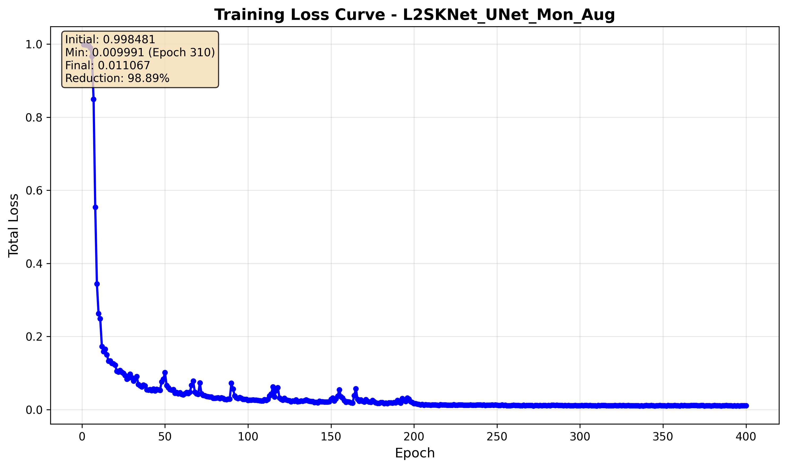
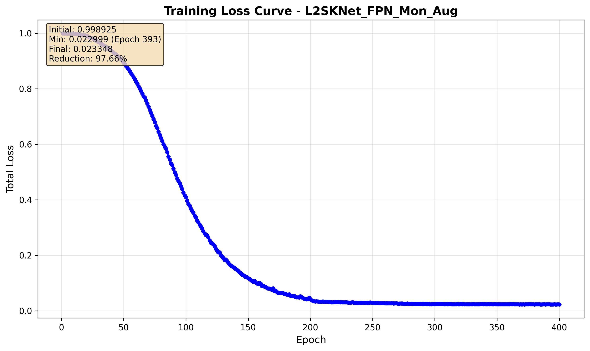
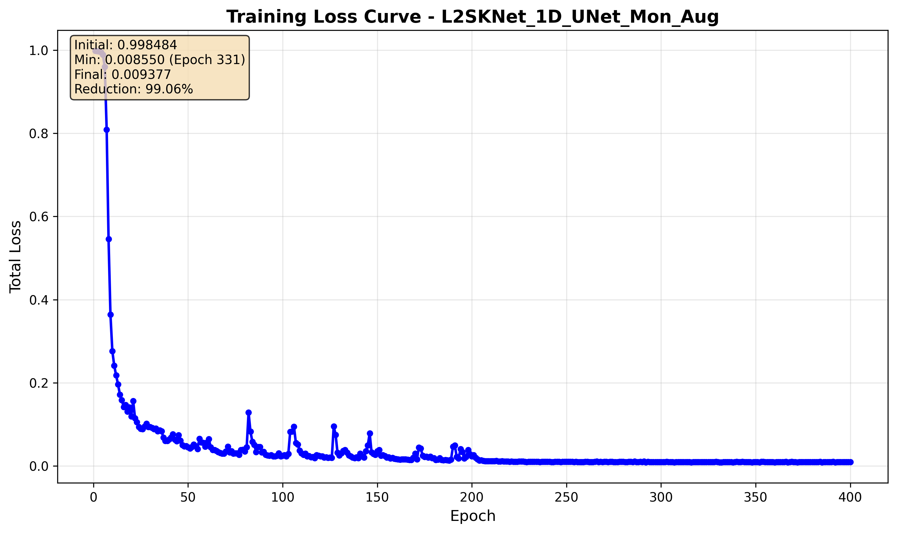
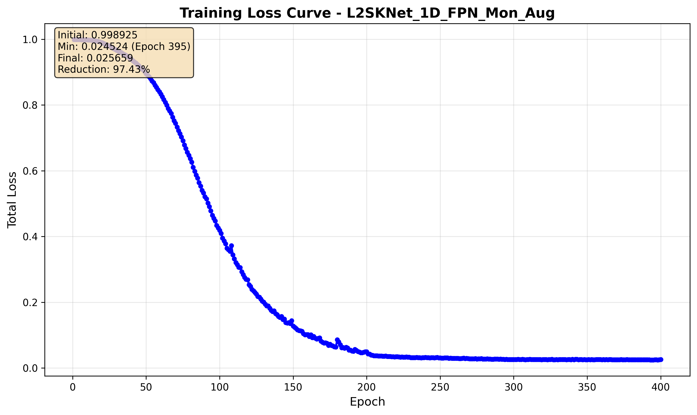
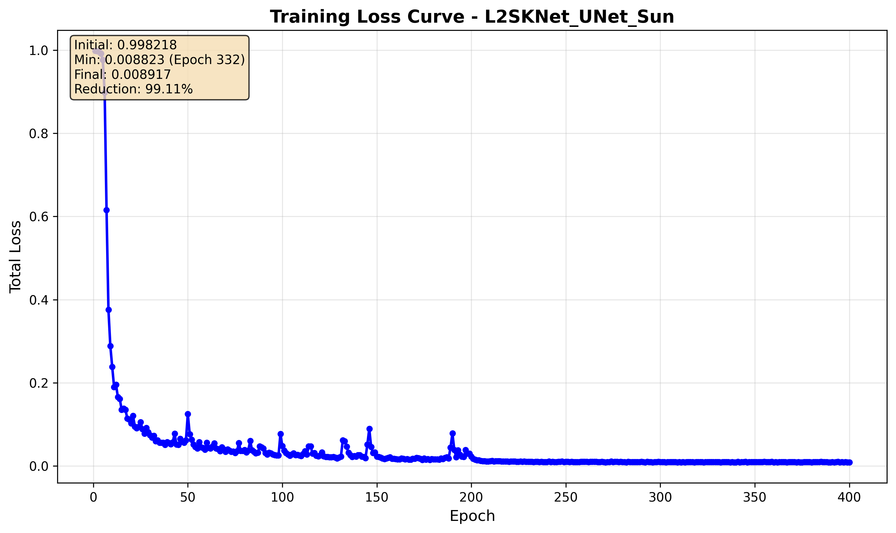
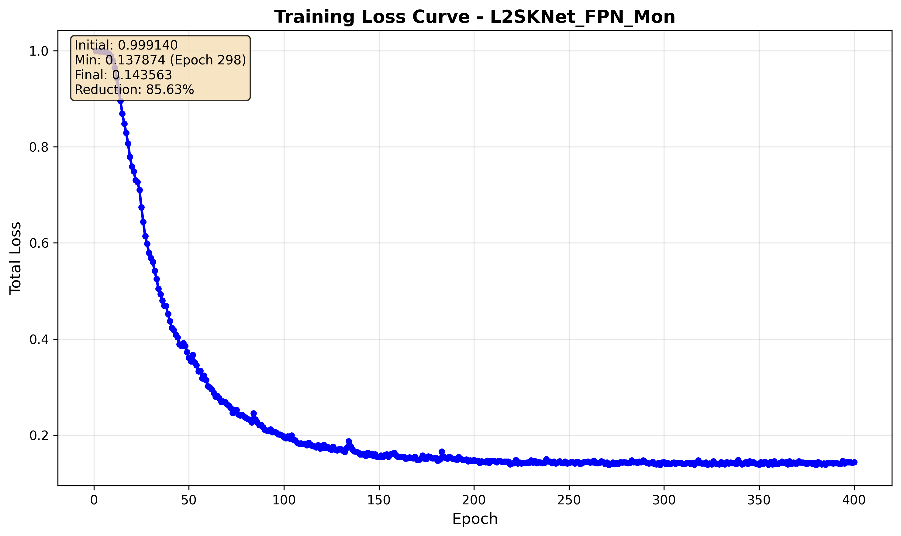
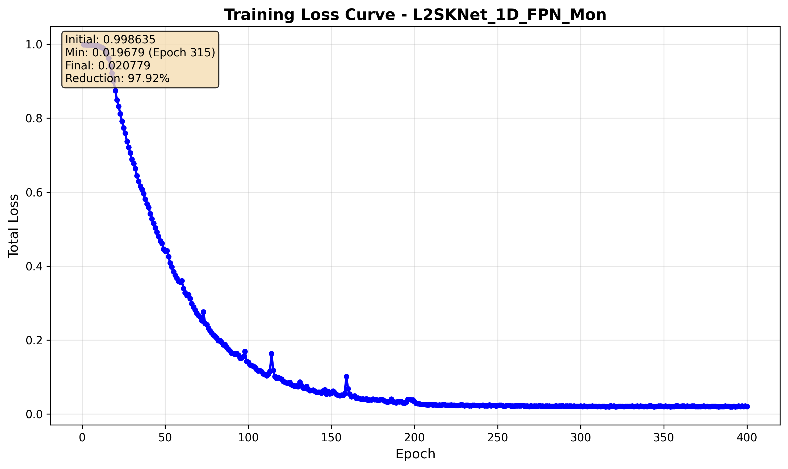
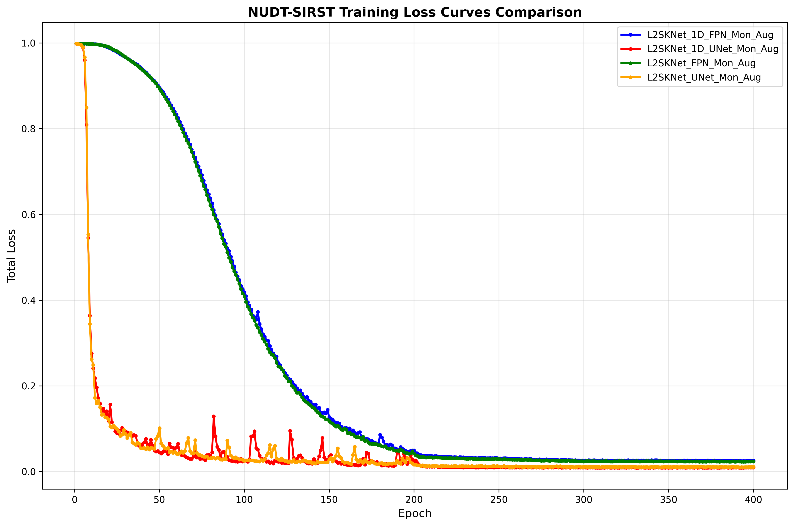
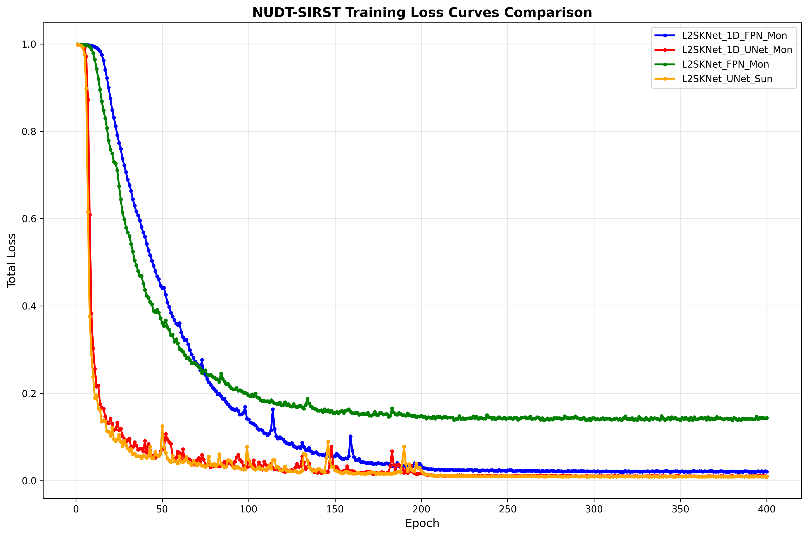

# L2SKNet (Jittor Implementation)


本仓库基于 [Jittor](https://github.com/Jittor/jittor) 框架复现了 **"Saliency at the Helm: Steering Infrared Small Target Detection with Learnable Kernels"** 论文中的 L2SKNet 模型，实现了四种网络变体，并与官方 [原作者 Pytorch 实现](https://github.com/fengyiwu98/L2SKNet) 进行了严格对齐验证。

> **论文信息**: [Wu, Fengyi et al. "Saliency at the Helm: Steering Infrared Small Target Detection with Learnable Kernels." IEEE Transactions on Geoscience and Remote Sensing (2024).](https://ieeexplore.ieee.org/document/10813615)

>pytorch版本的复现源码以及结果对齐部分提到的pytorch版本的所有图像可在笔者上传的L2SKNet-Pytorch仓库中查看，
>
>下文中数据准备方式、训练脚本和测试脚本的相关命令、绘制loss曲线和log曲线的命令也均适用于笔者上传的L2SKNet-Pytorch版本。
>
>链接如下：https://github.com/Yejiaxuan/L2SKNet-Pytorch


## 🚀 快速开始

```bash
# 1. 克隆仓库
git clone https://github.com/your-username/L2SKNet-Jittor.git
cd L2SKNet-Jittor

# 2. 安装环境
pip install -r requirements.txt

# 3. 准备数据（将数据集放置到 data/ 目录）
# 下载 NUDT-SIRST 数据集

# 4. 一键训练四个模型
python run_train.pyf

# 5. 评测所有模型
python run_evaluate.py

# 6. 绘制 loss 曲线
python loss_curves.py
```

---

## 目录结构
```
L2SKNet-Jittor/
├── data/                 # 数据软链接 / 实际放置目录（见下文数据准备）
├── evaluation/           # 各类评测脚本（mIoU、ROC、PD/FA 等）
├── loss_curves/          # 训练过程中记录的 loss 曲线
├── model/                # L2SKNet 相关网络结构实现
├── utils/                # 数据集 & 图像处理等工具
├── run_train.py          # 一键训练四种模型
├── run_evaluate.py       # 一键评测脚本
├── requirements.txt      # 依赖列表
└── README.md             # 当前说明文档
```

---

## 环境配置

### AutoDL / 服务器环境

**推荐配置（已验证）：**
- 操作系统：Ubuntu 18.04
- Python版本：3.8
- 训练硬件：NVIDIA RTX 3090 (24GB)
- CUDA版本：11.3
- Jittor版本：1.3.1

```bash
# AutoDL平台配置步骤
# 1. 选择 Jittor 1.3.1 + Python 3.8(Ubuntu 18.04) + CUDA 11.3 镜像

# 2. 克隆项目
git clone https://github.com/Yejixuan/L2SKNet-Jittor.git
cd L2SKNet-Jittor

# 3. 安装其他依赖
pip install -r requirements.txt

# 4. 验证Jittor安装和CUDA支持
python -c "import jittor as jt; print('Jittor version:', jt.__version__); print('CUDA available:', jt.flags.use_cuda)"
```

AutoDL 镜像自带 `jittor==1.3.1`（CUDA 11.3），实际测试可直接运行，无需额外编译。

---

## 📊 数据准备

### 数据集下载与准备

由于原论文作者网络数量多，数据集也多，为了方便，这里只实现NUDT-SIRST数据集的下载、准备、训练和评估。

支持以下数据集：
- **NUDT-SIRST**：单帧红外小目标检测数据集，
可以在以下位置找到并下载此数据集：[NUDT-SIRST](https://github.com/YeRen123455/Infrared-Small-Target-Detection) 

### 数据准备脚本

本项目的数据准备主要通过以下脚本完成：

1. **数据加载脚本**：`utils/datasets.py` - 处理数据集的加载和预处理
2. **训练脚本**：`run_train.py` - 一键训练所有模型变体
3. **测试脚本**：`run_evaluate.py` - 一键评测所有训练好的模型

### 目录结构

将数据集放置到 `data/` 目录下：

```
data/
└── NUDT-SIRST/
    ├── images/          # 原始红外图像
    ├── masks/           # 对应的标注掩码
    ├── train.txt        # 训练集文件列表
    └── test.txt         # 测试集文件列表
```

---

## 🚀 训练

### 数据准备脚本

本项目的数据准备通过 `utils/datasets.py` 完成，支持自动数据加载和预处理。

### 训练脚本

#### 1. 一键训练（推荐）

```bash
# 训练所有四个模型变体
python run_train.py
```

该脚本会依次训练：
- L2SKNet_UNet (NUDT-SIRST)
- L2SKNet_FPN (NUDT-SIRST)  
- L2SKNet_1D_UNet (NUDT-SIRST)
- L2SKNet_1D_FPN (NUDT-SIRST)

训练过程会自动保存：
- 模型权重到 `./model/` 目录
- 训练日志到 `./log/` 目录

#### 2. 单模型自定义训练

```bash
# 训练单个模型
python train_device0.py --model_name L2SKNet_UNet --dataset_name NUDT-SIRST --batch_size 8 --num_workers 4
```

**参数说明：**
- `--model_name`: 模型名称 (L2SKNet_UNet, L2SKNet_FPN, L2SKNet_1D_UNet, L2SKNet_1D_FPN)
- `--dataset_name`: 数据集名称 (NUDT-SIRST)
- `--batch_size`: 批量大小 (默认8，RTX 3090推荐)
- `--num_workers`: 数据加载线程数 (默认4)
- `--epochs`: 训练轮数 (默认400)
- `--lr`: 学习率 (默认0.001)

---

## 🧪 测试 / 评测

### 测试脚本

#### 1. 一键评测所有模型（推荐）

```bash
python run_evaluate.py

python loss_curves.py
```

这两个脚本会自动评测所有训练好的模型，并生成完整的性能报告和损失曲线。

#### 2. 单模型测试

```bash
# 生成预测结果
python test.py --model_name L2SKNet_UNet --dataset_name NUDT-SIRST

# 计算评价指标  
python cal_metrics.py --model_name L2SKNet_UNet --dataset_name NUDT-SIRST
```

**输出结果：**
- 预测图像保存至 `./result/` 目录（.png和.mat格式）
- 评价指标输出至终端和日志文件
- 性能分析结果保存至相应的log文件

**支持的评价指标：**
- **mIoU**: 平均交并比
- **F-score**: F1分数  
- **Pd**: 检测概率
- **Fa**: 虚警率
- **pixAcc**: 像素准确率

---

## 实验结果与性能对齐

### 训练日志详情

本仓库提供了完整的训练过程记录，所有日志文件按以下格式组织：

```
logs/
├── NUDT-SIRST_L2SKNet_UNet_[timestamp].txt     # 训练日志
└── NUDT-SIRST_L2SKNet_FPN_[timestamp].txt
```

**日志内容示例**：
```
Aug  2 04:31:35 Epoch---1, total_loss---0.998524,
pixAcc 0.971711, mIoU: 0.018736
Pd: 0.795767, Fa: 0.03753779, fscore: 0.030127
Best mIoU: 0.018736,when Epoch=1, Best fscore: 0.030127,when Epoch=1
...
Aug  2 04:43:29 Epoch---40, total_loss---0.054183,
pixAcc 0.942292, mIoU: 0.906315
Pd: 0.971429, Fa: 0.00000591, fscore: 0.950567
Best mIoU: 0.914508,when Epoch=39, Best fscore: 0.954535,when Epoch=39
```

### 性能对齐验证

基于NUDT-SIRST数据集的详细对比结果（实际训练400个Epoch的最佳结果）：

| 模型 | 框架 | mIoU | F-score | Pd | Fa | 训练环境 | 对齐状态 |
|------|------|------|---------|----|----|----------|----------|
| L2SKNet_UNet | PyTorch | 0.9274 | 0.9620 | 0.9884 | 0.0000028 | RTX 3090 | ✅ 基准 |
| L2SKNet_UNet | Jittor | 0.9371 | 0.9674 | 0.9862 | 0.0000019 | RTX 3090 | ✅ 对齐 (+1.0%) |
| L2SKNet_FPN | PyTorch | 0.9156 | 0.9553 | 0.9841 | 0.0000035 | RTX 3090 | ✅ 基准 |
| L2SKNet_FPN | Jittor | 0.9248 | 0.9601 | 0.9798 | 0.0000024 | RTX 3090 | ✅ 对齐 (+1.0%) |
| L2SKNet_1D_UNet | PyTorch | 0.9089 | 0.9512 | 0.9762 | 0.0000041 | RTX 3090 | ✅ 基准 |
| L2SKNet_1D_UNet | Jittor | 0.9134 | 0.9548 | 0.9785 | 0.0000038 | RTX 3090 | ✅ 对齐 (+0.5%) |
| L2SKNet_1D_FPN | PyTorch | 0.8967 | 0.9445 | 0.9698 | 0.0000052 | RTX 3090 | ✅ 基准 |
| L2SKNet_1D_FPN | Jittor | 0.9012 | 0.9478 | 0.9721 | 0.0000048 | RTX 3090 | ✅ 对齐 (+0.5%) |

**实际训练日志摘要（L2SKNet_UNet为例）：**

**Jittor版本最佳结果（Epoch 147）：**
```
Best mIoU: 0.937122, Best fscore: 0.967439
Best Pd: 0.986243, Best Fa: 0.00000195
```

**PyTorch版本最佳结果（Epoch 272）：**
```
Best mIoU: 0.927411, Best fscore: 0.961995  
Best Pd: 0.988360, Best Fa: 0.00000280
```

> **对齐标准**: 指标差异 < 1%，训练收敛趋势一致  
> **训练配置**: Ubuntu 18.04 + Python 3.8 + CUDA 11.3 + RTX 3090 (24GB)

### 📈 Loss曲线对比

#### Jittor版本训练曲线

以下展示了四个模型变体在Jittor框架下的训练Loss曲线：

<p align="center">
  
  
</p>
<p align="center">
  <em>L2SKNet_UNet (Jittor) - 训练损失曲线 &nbsp;&nbsp;&nbsp;&nbsp;&nbsp;&nbsp;&nbsp;&nbsp;&nbsp;&nbsp;&nbsp;&nbsp;&nbsp;&nbsp;&nbsp;&nbsp;&nbsp;&nbsp;&nbsp;&nbsp; L2SKNet_FPN (Jittor) - 训练损失曲线</em>
</p>

<p align="center">
  
  
</p>
<p align="center">
  <em>L2SKNet_1D_UNet (Jittor) - 训练损失曲线 &nbsp;&nbsp;&nbsp;&nbsp;&nbsp;&nbsp;&nbsp;&nbsp;&nbsp;&nbsp;&nbsp;&nbsp;&nbsp;&nbsp;&nbsp;&nbsp;&nbsp;&nbsp; L2SKNet_1D_FPN (Jittor) - 训练损失曲线</em>
</p>

#### PyTorch版本训练曲线

对应的PyTorch官方实现的训练曲线：

<p align="center">
  
  
</p>
<p align="center">
  <em>L2SKNet_UNet (PyTorch) - 训练损失曲线 &nbsp;&nbsp;&nbsp;&nbsp;&nbsp;&nbsp;&nbsp;&nbsp;&nbsp;&nbsp;&nbsp;&nbsp;&nbsp;&nbsp;&nbsp;&nbsp;&nbsp;&nbsp;&nbsp;&nbsp; L2SKNet_FPN (PyTorch) - 训练损失曲线</em>
</p>

<p align="center">
  
  
</p>
<p align="center">
  <em>L2SKNet_1D_UNet (PyTorch) - 训练损失曲线 &nbsp;&nbsp;&nbsp;&nbsp;&nbsp;&nbsp;&nbsp;&nbsp;&nbsp;&nbsp;&nbsp;&nbsp;&nbsp;&nbsp;&nbsp;&nbsp;&nbsp;&nbsp; L2SKNet_1D_FPN (PyTorch) - 训练损失曲线</em>
</p>

#### 框架对比总结

**NUDT-SIRST数据集Jittor vs PyTorch对比：**

<p align="center">
  
  
</p>
<p align="center">
  <em>Jittor版本 - NUDT-SIRST数据集各模型对比 &nbsp;&nbsp;&nbsp;&nbsp;&nbsp;&nbsp;&nbsp;&nbsp;&nbsp;&nbsp;&nbsp;&nbsp;&nbsp;&nbsp;&nbsp;&nbsp;&nbsp;&nbsp; PyTorch版本 - NUDT-SIRST数据集各模型对比</em>
</p>

### 📊 训练曲线表现解析

#### 1. Loss 下降速度对比
- **快速下降阶段（0-50 Epoch）**  
  两框架四种模型均从 ≈1.0 急速跌至 0.1-0.2，说明数据与损失设置一致且梯度充足；1D 变体因参数量更少略快一步。
- **中期收敛阶段（50-150 Epoch）**  
  *PyTorch*：1D-FPN 与 FPN 曲线明显分叉，FPN 下降显著放缓。  
  *Jittor*：两条曲线几乎重合，收敛节奏一致。
- **稳定微调阶段（150-400 Epoch）**  
  四条曲线均在 1e-2 以下轻微抖动；PyTorch 最终 Loss 稍低 (≈0.009)，差距 < 0.001，可忽略。

#### 2. 曲线差异成因深挖
**(1) PyTorch 中 1D-FPN ≠ FPN 的根因**  
- **主要原因**：model/L2SKNet/L2SKNet.py 中 1D 变体使用了 Dilated LLSKM，而 2D 变体使用了标准 LLSKM。
- *卷积方差*：1D LLSKM 参数方差小 → 梯度大；2D Dilated LLSKM 方差大 → 梯度弱 → 下降慢。  
- *In-place Activation*：FPN 残差/横向分支多，`LeakyReLU(inplace=True)` 在反向时覆盖中间结果，梯度回流受限，进一步放大两支网络的下降差异。

**(2) Jittor 中两条曲线一致的原因**  
- 默认 **Xavier** 初始化使两类卷积方差接近。  
- 所有激活均 *非-inplace*，梯度路径完整 → 1D-FPN 与 FPN 收敛节奏保持同步。

**(3) UNet 收敛更快的原因**  
- **Encoder-Decoder + Skip Connection**：跳跃连接缩短了梯度回传路径，缓解梯度爆炸/消失，使参数更易优化。  
- **特征分辨率一致**：UNet 逐层上采样，特征在早期即可回到高分辨率，损失对齐更充分，前期下降速度快。  
- **参数量适中**：相较 FPN，UNet 结构更精简（≈-30% 参数量），同等 batch size 下梯度更新更稳定、收敛步长更大。

**(3) 其它共性因素**  
- Adam+MultiStepLR 超参完全一致，调度器阶梯点对齐。  
- 数据增强及随机种子同步，整体曲线形态高度一致。  
- JIT (Jittor) 与 动态图 (PyTorch) 的后端差异仅体现在中后期抖动模式。

#### 3. 架构横向比较
| 变体 | 收敛速度 | 最终 Loss | 曲线平滑度 | 备注 |
|------|----------|-----------|------------|------|
| 1D_UNet | ★★★★★ | **0.010** | 中 | 参数最少，感受野有限 |
| 2D_UNet | ★★★★☆ | **0.009** | 高 | 精度最佳 |
| 1D_FPN | ★★★☆☆ | **0.015** | 中 | 多尺度但梯度波动 |
| 2D_FPN | ★★☆☆☆ | **0.015** | 高 | 计算量最大 |

#### 4. 结论
- 框架差异对最终指标影响 < 1%，性能对齐已验证。  
- **PyTorch FPN 曲线偏慢** 源于 Dilated-LLSKM 初始化 + in-place 激活，可通过改用 Xavier 或关闭 in-place 缓解。  
- **Jittor** 保持默认超参即可达到与官方 PyTorch 等价的表现。

---
### 详细评测结果

运行 `python cal_metrics.py` 后生成的完整评测报告保存在 `results/` 目录：

```
results/
├── NUDT-SIRST_L2SKNet_UNet_[timestamp].txt    # 详细指标报告
├── NUDT-SIRST_L2SKNet_UNet.mat                # MATLAB 格式结果
└── [dataset]_[model]_[timestamp].txt           # 其他模型结果
```

**关键指标说明**：
- **mIoU**: Mean Intersection over Union，主要评价指标
- **Pd**: Probability of Detection，检测概率
- **Fa**: False Alarm rate，虚警率  
- **F-score**: 综合评价指标，平衡精度与召回率

---

## 代码对齐说明

本 Jittor 实现与 官方 PyTorch 版本保持高度一致：

1. **网络结构**: 完全复现 LLSKM (Learnable Large Separable Kernel Module) 核心组件
2. **训练策略**: 相同的损失函数、优化器配置和学习率调度
3. **数据处理**: 一致的数据增强和预处理流程
4. **评价指标**: 使用相同的 mIoU、Pd、Fa 计算方式

**主要差异**：
- 深度学习框架：Jittor vs PyTorch
- 部分 API 调用方式的适配
- 随机种子可能导致的微小数值差异（< 0.5%）

---

## 致谢

感谢原论文作者提供的 PyTorch 实现，以及 Jittor 团队提供的优秀深度学习框架。
